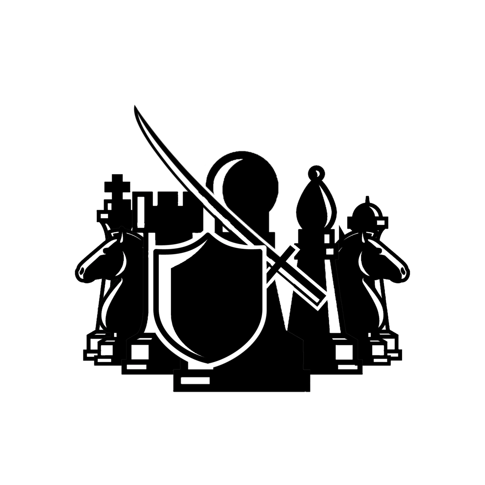

# ♟🧩 Chess Game 🧩♟

Desenvolvimento de um jogo de xadrez, utilizando Javascript

<pre>
    *************************************************************************
    *        **********        **********        **********        **********
    *        **********        **********        **********        **********
    *        **********        **********        **********        **********
    *************************************************************************
    **********        **********        **********        **********        *
    **********        **********        **********        **********        *
    **********        **********        **********        **********        *
    *************************************************************************
    *        **********        **********        **********        **********
    *        **********        **********        **********        **********
    *        **********        **********        **********        **********
    *************************************************************************
    **********        **********        **********        **********        *
    **********        **********        **********        **********        *
    **********        **********        **********        **********        *
    *************************************************************************
    *        **********        **********        **********        **********
    *        **********        **********        **********        **********
    *        **********        **********        **********        **********
    *************************************************************************
    **********        **********        **********        **********        *
    **********        **********        **********        **********        *
    **********        **********        **********        **********        *
    *************************************************************************
    *        **********        **********        **********        **********
    *        **********        **********        **********        **********
    *        **********        **********        **********        **********
    *************************************************************************
    **********        **********        **********        **********        *
    **********        **********        **********        **********        *
    **********        **********        **********        **********        *
    *************************************************************************
</pre>

## Lista de Implementações a serem realizadas

🔰 Retornar o código da casa em que a peça foi clicada;

🔰 Montar um objeto com as peças e as possibilidades atuais de movimento;

🔰 Desenvolver uma função que retorne as casas possíveis para a peça em foco;

🔰 Exibir no tabuleiro as casas possíveis para a peça em foco;

🔰 Criar uma seção, ao lado do tabuleiro, para as peças que forem eliminadas;

🔰 Garantir que um jogador realize um movimento apenas quando o outro já o tiver feito, exceto no início;

🔰 Desenvolver a lógica de roque / jogadas especiais;

🔰 Desenvolver a lógica de xeque / xeque-mate;